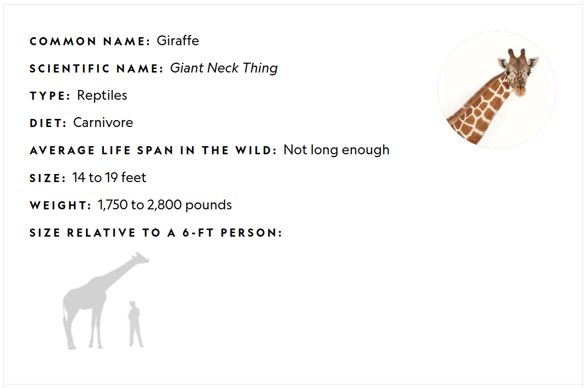
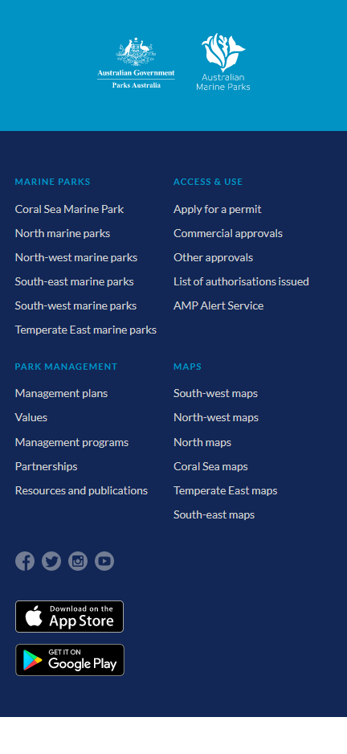
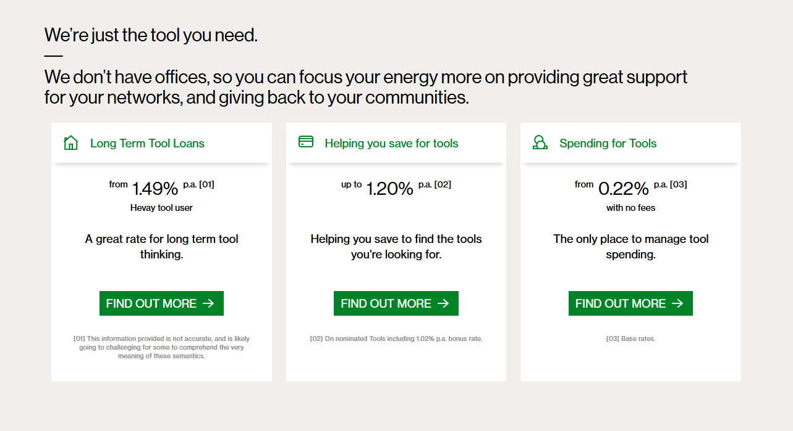
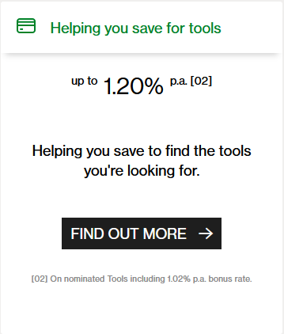
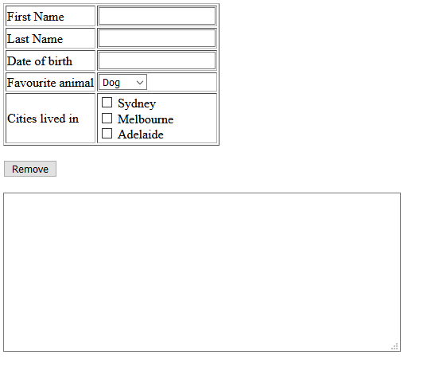
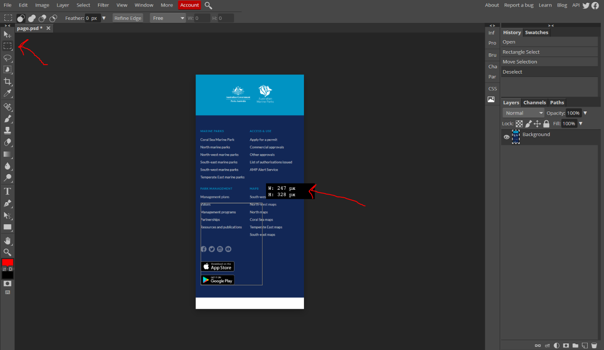

# Assessment 1 - CSS: Copy Some Screens

## Change Log

* 15/09: Scope of validity checking for date clarified
* 17/09: Adding person sitting .svg to ass5
* 17/09: Clarified what a valid date is
* 18/09: Clarified that you can't import code from EXTERNAL libraries only. `<link />` is allowed if you wrote the code.
* 20/09: Clarity that task 5 big image is 1696px wide, not the original 1969px. The image hasn't changed, its just that the spec lists the correct width now.
* 21/09: For exercise 5, "Clicked" re-phrased to say "Hovered or active, you can choose one or the other" to add more clarity. We are giving choice between doing the `:hover` or `:active` state, due to the confusion of previous statement.
* 24/09: Updated regex for date for task6
* 26/09: Adding firstname/lastname validity clarification that was accidentally removed

## Background & Motivation

This assessment focuses on you implementing a series of basic web pages that look and behave like images and descriptions we we provide.

A basic capability required of someone working with user-facing interfaces is to be able to produce a web page that looks and behaves like something that has been clearly specified (e.g. an image). A common workflow within a product team may consist of a designer producing a high fidelity mock-up, which a developer will then take and use HTML/CSS/JS to build the webpage for usage. In reality this process tends to be a bit more collaborative, and the high fidelity mockups provided are usually quite detailed and visually consist of many interact layers. However, for the sake of simplicity and fundamental knowledge we are providing flattened images with written requirements.

This assessment aims to allow students to demonstrate knowledge they've developed during week 1-3 of the course. You will be building web pages with HTML, CSS, and Javascript.

This assessment primarily focuses on demonstrating skills with HTML ("Hyper Text Markup Language") and CSS ("Cascading Style Sheets") covered in week 1 of the course. Most of the tasks centre around this.

The latter part of this assessment touches on some topics from weeks 2 and 3. Don't be alarmed if you can't do these tasks until the start of the third week - you should be able to complete the vast majority of the assessment before getting to this point.

## Tasks

### Task 1 - Static, fixed size page

Build a page that looks identical to `task1/page.png`. The window width you should work with is 1011 x 669 pixels. You are only allowed to use HTML and CSS for this task. No external libraries are permitted.

Please build your page in `task1/index.html`. You are welcome to create as many CSS files that you need in the `task1` folder for `index.html` to import. When being marked, your tutor will start with `index.html`.

#### Assets

* The assets are provided in `task1/asset1.jpg` and `task1/asset2.gif`
* Your font doesn't have to match exactly. Please use font-family `Gill Sans MT` or `Century Gothic` for the page.

### Task 2 - Static, fixed size page

Build a page that looks identical to `task2/page.png`. The window width you should work with is 787 x 786 pixels. You are only allowed to use HTML and CSS for this task. No external libraries are permitted.

Please build your page in `task2/index.html`. You are welcome to create as many CSS files that you need in the `task2` folder for `index.html` to import. When being marked, your tutor will start with `index.html`.

#### Assets
* Your font doesn't have to match exactly. Please use font-family `Arial` for the page.

### Task 3 - Static, fixed size page

Build a page that looks identical to `task3/page.png`. The window width you should work with is 432 x 938 pixels. You are only allowed to use HTML and CSS for this task. No external libraries are permitted.

Please build your page in `task3/index.html`. You are welcome to create as many CSS or JS files that you need in the `task3` folder for `index.html` to import. When being marked, your tutor will start with `index.html`.

#### Assets
* Your font doesn't have to match exactly. Please use font-family `Arial` for the page.
* The assets for the social icons on this page are SVGs. We have placed these SVGs in separate HTML files for you to copy and paste into your index.html.
  * `task3/asset1.html`
  * `task3/asset2.html`
  * `task3/asset3.html`
  * `task3/asset4.html`
* The assets for the google and apple play on this page are SVGs. In this case we have just given you the SVG files to include (typically via import)
  * `task3/asset_android.svg`
  * `task3/asset_apple.svg`

### Task 4 - Static, fixed size page

Build a page that looks identical to `task4/page.png`. The window width you should work with is 1283 x 699 pixels. You are only allowed to use HTML and CSS for this task. No external libraries are permitted.

Please build your page in `task4/index.html`. You are welcome to create as many CSS files that you need in the `task4` folder for `index.html` to import. When being marked, your tutor will start with `index.html`.

You are also expected to handle the hover state for the "FIND OUT MORE" buttons. The main difference is the colour change, and the horizontal placement of the right-arrow. The hover state is shown in the diagram below:

#### Assets
* Your font doesn't have to match exactly. Please use font-family `Arial` for the page.
* The assets for the social icons on this page are SVGs. We have placed these SVGs in separate HTML files for you to copy and paste into your index.html.
  * `task4/asset1.html`
  * `task4/asset2.html`
  * `task4/asset3.html`

### Task 5 - Responsive static page

Build a responsive page that complies with `task5/page_big.png` and `task5/page_small`. The big page is 1696 x 1236 pixels, and the small page is 595 x 1094 pixels. Your single page (note that you're only not using two separate HTML files) should like identical to either of these pages depending on the window sized the browser is at.

Your are expected to have reasonable intermediate states. In other words, if the window size is some combination of widths between 1969 and 595, combined with some combination of heights between 1236 and 1094, the page should still reflect the same general structure.

Please build your page in `task5/index.html`. You are welcome to create as many CSS files that you need in the `task5` folder for `index.html` to import. When being marked, your tutor will start with `index.html`.

On top of this you are required to:
 * ensure that the *Find a Friend* button has a hover opacity of 0.7
 * "Join now" should have inverted colours (background, text, border) when in one of the hovered or active state (you choose which one you want to implement - either are fine). No Javascript is required.

#### Assets
* Your font doesn't have to match exactly. Please use font-family `Arial` for the page.

### Task 6 - Dynamic form

The page `task6/page.png` displays a series of inputs, and when valid, outputs a "summary" of this information in the textarea at the bottom of the page.

No CSS is required in this task. Please do not worry about styling your pages.

#### The page

Make a page `page6/index.html`.

The page consists of a:
 * Table
   * Text input for First Name (must be between 3 and 50 characters)
   * Text input for Last Name (must be between 3 and 50 characters)
   * Text input for Date of birth (valid input is the exactformat "DD/MM/YYYY" and must be a valid date. This means it must match the regex expression "[0-9]{2}/[0-9]{2}/[0-9]{4}" and when trying to parse it with the Javascript date object it does not return **NaN**)
   * Dropdown for favourite animal (either "Dog" or "Puppy", no other options)
   * Checkbox for cities that they've lived in (Sydney, Melbourne, Adelaide)
 * Remove button
 * Textarea (initially blank)

#### Actions

The following are events that trigger a render that should be binded to particular actions
* Changing of the "cities lived in", or "favourite animal" should trigger a render
* Blur of the "First Name", "Last Name", or "Date of birth" should trigger a render

When the "remove" button is clicked, the `textarea` has all of its text removed (i.e. it becomes blank again), and all of the form elements in the table are reset to their default state.

#### Rendering

The "output" refers to what the inner HTML text should be of the textarea at the bottom of the page.

* If they haven't inputted a firstname, or the firstname entered is invalid, the output should be "Please input a valid firstname"
* If they have inputted a first name, but haven't inputted a last name or the lastname is invalid, the output should be "Please input a valid lastname"
* If they have inputted a first name and a last name, but haven't inputted a valid date of birth, the output should be "Please enter a valid date of birth"
* If they have entered a valid first name, last name, and date of birth, the output is "Hello [first name] [last name], you are [age (integer)] years old, your favourite animal is [favourite animal] and you've lived in [cities]."
  * If no cities are selected, [cities] is "no cities"
  * If 1 city is selected, [cities] is just "[city1]"
  * If 2 or more cities are selected, [cities] is just "[city1], [city2], [city3]"

## Analysing the pages

Two things will want to seek external help for are:
1) Determining the particular colour (RGB or HEX) of various pixels (we recommend the use of [the Firefox eye dropper](https://developer.mozilla.org/en-US/docs/Tools/Eyedropper), though other alternatives may be appropriate for you)
2) Determining the size of particular elements (we recommend the use of [photopea](https://www.photopea.com/)). An example of it's usage is below:

## Constraints & Assumptions

### Browser Compatibility

You should ensure that your programs have been tested on one of the following two browsers:
 * Locally, Google Chrome (various operating systems) version 85.XX
 * On CSE machines, Chromium version 83.XX

### External libraries

You are restricted from using any third party CSS or JS libraries when completing this assessment. Basically, this means you can't import code using the `<script />` and `<link />` tags if it's from a file you did not write yourself, and you shouldn't be copying any larger chunks of code from other sources.

## Marking Criteria

Your assignment will be hand-marked by tutor(s) in the course according to the criteria below.

<table>
	<tr>
		<th>Criteria</th>
		<th>Weighting</th>
		<th>Description</th>
	</tr>
	<tr>
		<td>Visual Compliance</td>
		<td>50%</td>
		<td>
			<ul>
				<li>Rendered static HTML page accurately matches the reference image provided for each task</li>
				<li>For specified tasks, pseudo-class behaviour satisfies the task requirements</li>
				<li>For specified tasks, rendered HTML page renders appropriately for intermediate sizes</li>
				<li>For specified tasks, JS events triggered by specific actions occur as specified</li>
			</ul>
		</td>
	</tr>
	<tr>
		<td>Code Quality</td>
		<td>40%</td>
		<td>
			<ul>
				<li>HTML is appropriately formatted such that each inner HTML is indented with respect to the outer one</li>
				<li>CSS is appropriate structured to be placed in external stylesheets rather than inline styles</li>
				<li>CSS ID and class selectors are clearly and meaningfully named</li>
				<li>CSS has limited repetition where multiple similar components use the same underlying styles</li>
				<li>JS code is appropriately styled and formatted based on common conventions shown in lectures</li>
				<li>Ensure that source code (HTML, CSS, JS) is no more complicated or verbose than necessary to solve a given problem (less is more).</li>
			</ul>
		</td>
	</tr>
	<tr>
		<td>Modern Methods</td>
		<td>10%</td>
		<td>
			<ul>
				<li>Maintaining separation between HTML and CSS for structural and stylistic aspects, respectively</li>
				<li>Avoiding usage of more obselete methods of page styling that have been discussed in lectures (e.g. tables for non-tabular purposes)</li>
			</ul>
		</td>
	</tr>
</table>

## Originality of Work

The work you submit must be your own work.  Submission of work partially or completely derived from
any other person or jointly written with any other person is not permitted.

The penalties for such an offence may include negative marks, automatic failure of the course and
possibly other academic discipline. Assignment submissions will be examined both automatically and
manually for such submissions.

Relevant scholarship authorities will be informed if students holding scholarships are involved in
an incident of plagiarism or other misconduct.

Do not provide or show your assignment work to any other person &mdash; apart from the teaching
staff of COMP6080.

If you knowingly provide or show your assignment work to another person for any reason, and work
derived from it is submitted, you may be penalized, even if the work was submitted without your
knowledge or consent.  This may apply even if your work is submitted by a third party unknown to
you.

Every time you make commits or pushes on this repository, you are acknowledging that the work you
submit is your own work (as described above).

Note you will not be penalized if your work has the potential to be taken without your consent or
knowledge.

## Submission

This assignment is due *Sunday 4th of October, 19:59:59*.

Our systems automatically record the most recent push you make to your `master` branch. Therefore,
to "submit" your code you simply need to make sure that your `master` branch (on the gitlab website)
is the code that you want marked for this task.

It is your responsibiltiy to ensure that your code can be successfully demonstrated on the CSE machines (e.g. vlab)
from a fresh clone of your repository. Failure to ensure this may result in a loss of marks.

## Late Submission Policy

If your assignment is submitted after this date, each hour it is late reduces the maximum mark it can achieve by 2%.

For example if an assignment you submitted with a raw awarded mark of 85% was submitted 5 hours late, the late submission would have no effect (as maximum mark would be 90%). If the same assignment was submitted 20 hours late it would be awarded 60%, the maximum mark it can achieve at that time.
