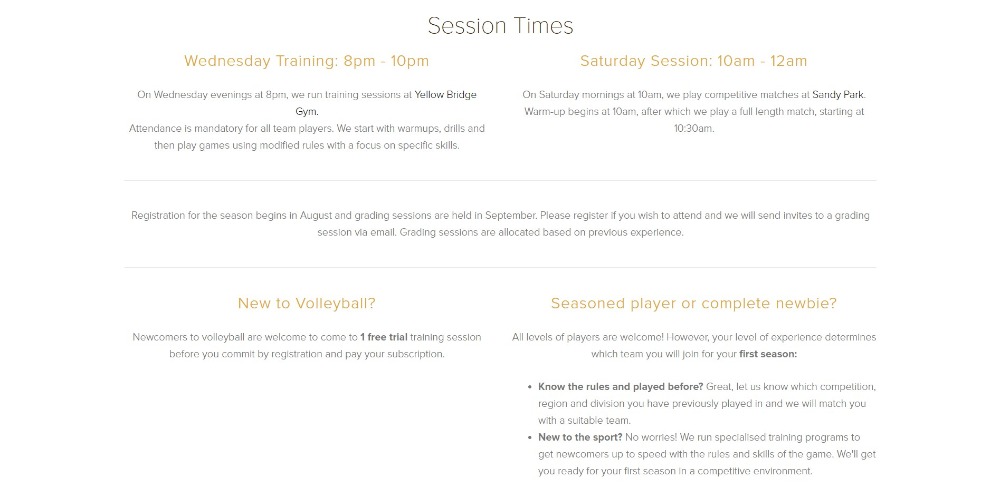

# Lab 01

### Due: Week 1, Sunday, 8:00 pm

### Value: 2 marks

## Overview

### Aim

* Learn how to use GitLab effectively
* Demonstrate competence in using HTML and CSS to build webpages based off of a visual example

### Analysing the pages

Two things will want to seek external help for are (that you can't determine just by "looking" at it):
1) Determining the particular colour (RGB or HEX) of various pixels (we recommend the use of [the Firefox eye dropper](https://developer.mozilla.org/en-US/docs/Tools/Eyedropper), though other alternatives may be appropriate for you)
2) Determining the size of particular elements (we recommend the use of [photopea](https://www.photopea.com/)). An example of it's usage is below:

### How closely to match images

Your page has to generally look the same, but doesn't have to be pixel perfect. We won't use a magnifying glass, though we will expect you to get the big things right. If you feel uncertain, please post in the forum.

## Exercise 1 - CSS & HTML

Build a page that looks identical to `exercise1/page.jpg`. The window width you can work with is up to you. We'll be flexible marking this. You are only allowed to use HTML and CSS for this task. No external libraries are permitted.

Please build your page in `exercise1/index.html`. You are welcome to create as many CSS files that you need in the `exercise1` folder for `index.html` to import. When being marked, your tutor will start with `index.html`.

### Assets

* Please use the following images:
    * Sydney: https://www.telegraph.co.uk/content/dam/Travel/Destinations/Oceania/Australia/Sydney/sydney-guide-lead-sunset.jpg
    * Melboune: https://www.rmit.edu.au/content/dam/rmit/au/en/news/news_Melbourne_AdobeStock.jpg
    * Adelaide: https://d31atr86jnqrq2.cloudfront.net/images/aerial-city-adelaide.jpg
* Your font doesn't have to match exactly. You may use font-family `Arial` or `sans-serif` for the page.

## Exercise 2 - CSS & HTML

Build a page that looks identical to `exercise2/page.jpg`. The window width you should work with is 1895 x 943 pixels. You are only allowed to use HTML and CSS for this task. No external libraries are permitted.

Please build your page in `exercise2/index.html`. You are welcome to create as many CSS files that you need in the `exercise2` folder for `index.html` to import. When being marked, your tutor will start with `index.html`.

### Assets

* Your font doesn't have to match exactly. You may use font-family `Arial Light` or `sans-serif` for the page.
* The text on the page is included in `exercise2/assets/text.txt`

## Exercise 3 - CSS & HTML

Build a page that looks identical to `exercise3/page.jpg`. The window width you should work with is 1896 x 1073 pixels. You are only allowed to use HTML and CSS for this task. No external libraries are permitted.

Please build your page in `exercise3/index.html`. You are welcome to create as many CSS files that you need in the `exercise3` folder for `index.html` to import. When being marked, your tutor will start with `index.html`.

### Assets

* Assets can be found in `exercise3/assets` which you can use for your solution.
* Your font doesn't have to match exactly. You may use font-family `Georgia` or `serif` for the page.
* You may use a Lorem Ipsum generator such as [this](https://www.lipsum.com/) to generate the text.

## Submission Instructions

Your master branch will automatically submit itself at the due date listed at the top of this page. Once you have completed your work, you must ensure that your master branch (on gitlab) reflects the code that you want to have submitted.