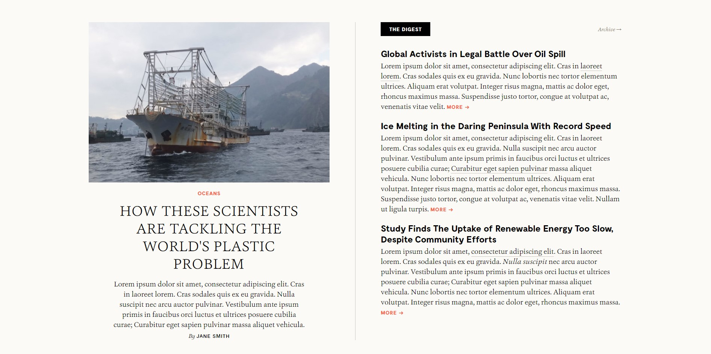
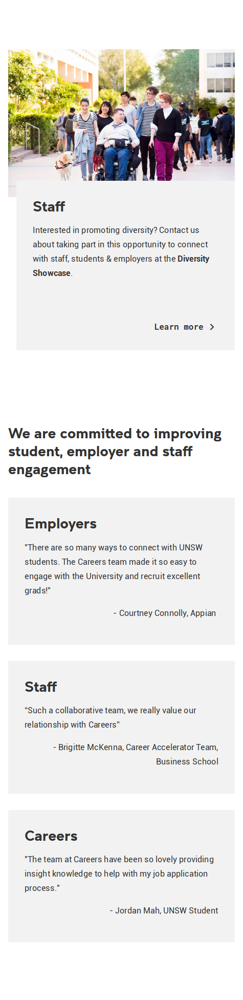
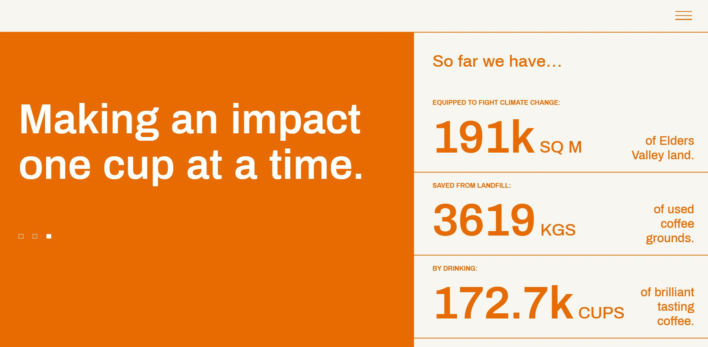

# Lab 02

### Due: Week 2, Sunday, 8:00 pm

### Value: 2 marks

## Overview

### Change Log
* 18/09: Replaced exercise 4 with exercise 4.5 - see comments in exercise 4
* 20/09: Just explicitly making clear that we've got a file `solutions/links.md` that show you the pages we used for these exercises. We'd recommend trying to finish the lab without looking at these, but if you run into difficult spots its a good chance to practice your dev tools skills.

### Aim

* Learn how to use GitLab effectively
* Demonstrate competence in using HTML and CSS to build webpages based off of a visual example
* Gain a basic understanding in the application and usage of NodeJS as a tool
* Demonstrate a very basic understanding of how to create a ReactJS app and modify it slightly

### Analysing the pages

Two things will want to seek external help for are (that you can't determine just by "looking" at it):
1) Determining the particular colour (RGB or HEX) of various pixels (we recommend the use of [the Firefox eye dropper](https://developer.mozilla.org/en-US/docs/Tools/Eyedropper), though other alternatives may be appropriate for you)
2) Determining the size of particular elements (we recommend the use of [photopea](https://www.photopea.com/)). An example of it's usage is below:


### How closely to match images

Your page has to generally look the same, but doesn't have to be pixel perfect. We won't use a magnifying glass, though we will expect you to get the big things right. If you feel uncertain, please post in the forum.


## Exercise 1 - HTML & CSS

Build a page that looks identical to `exercise1/page.jpg`. The window width you should work with is 1892 x 943 pixels. You are only allowed to use HTML and CSS for this task. No external libraries are permitted.



Please build your page in `exercise1/index.html`. You are welcome to create as many CSS files that you need in the `exercise1` folder for `index.html` to import. When being marked, your tutor will start with `index.html`.

### Assets

* Your fonts do not need to match exactly. You may use font-family `Garamond` or `serif` for all serif text, and font-family `Arial` or `sans-serif` for all non-serif text (i.e. the titles of the articles on the right).
* Assets can be found in `exercise1/assets` which you can use for your solution.
* You may use a Lorem Ipsum generator such as [this](https://www.lipsum.com/) to generate the text.

## Exercise 2 - HTML & CSS

Build a page that looks identical to `exercise2/page.png`. The window width you should work with is 475 x 1953 pixels. You are only allowed to use HTML and CSS for this task. No external libraries are permitted.



Please build your page in `exercise2/index.html`. You are welcome to create as many CSS files that you need in the `exercise2` folder for `index.html` to import. When being marked, your tutor will start with `index.html`.

### Assets

* Your fonts do not need to match exactly. You may use font-family `Helvetica` or `sans-serif` for the page.
* Assets can be found in `exercise2/assets` which you can use for your solution.

## Exercise 3 - HTML & CSS

Build a page that looks identical to `exercise3/page.jpg`. The window width you should work with is 1907 x 937 pixels. You are only allowed to use HTML and CSS for this task. No external libraries are permitted.



Please build your page in `exercise3/index.html`. You are welcome to create as many CSS files that you need in the `exercise3` folder for `index.html` to import. When being marked, your tutor will start with `index.html`.

### Assets

* Your fonts do not need to match exactly. You may use font-family `sans-serif` for the page.

## [Non-assessable] Exercise 4 - NodeJS

** PLEASE READ: Exercise 4 solutions were accidentally released, therefore we've added a question 4.5 alternative to do instead. You can use this question and its solutions as more learning material - so nothing lost on your end! If you were one of the keen beans who who completed this question (pushed to gitlab) prior to 10pm on Wednesday 16th September, you can simply show your tutor that you completed it early, and you are exempt from doing Exercise 4.5. **

*Please ensure you have watched the week 2 pre-recorded lectures on `npm` and `nodejs` before completing this activity.*

A javascript file that can be run with `node` has been created in `exercise4/numbers.js`. You must complete this program to analyse the numbers and print out the following result using the `console.log` function to print:

A list of numbers has been provided at the top of the file, and your output needs to print:
 * The sum of all numbers in that list
 * The sum of only positive numbers in that list
 * The sum of only even numbers in that list
 * The sum of all numbers above 400
 * The sum of numbers between array index 20 and 40 inclusively

The expected output should be (replacing X with correct answers):
```txt
Sum = X
Positive Sum = X
Even Sum = X
Sum of numbers above 400 = X
Sum of numbers between indexes 20 and 40 inclusively = X
````

## Exercise 4.5 - NodeJS

*Please ensure you have watched the week 2 pre-recorded lectures on `npm` and `nodejs` before completing this activity.*

A javascript file that can be run with `node` has been created in `exercise4.5/data.js`. You must complete this program to analyse the numbers and print out the following result using the `console.log` function to print:

A list of numbers has been provided at the top of the file, and your output needs to print:
 * A list of all negative numbers, in ascending order, surrounded by `[` and `]`, e.g. `[ -4, -2, -1 ]`
 * A single number that is the average of all positive numbers disivisble (without remainder) by 6, .e.g. `8.4`
 * A list of all numbers great than 600, as they appear in the list, but printed in reverse order, e.g. `[ 620, 610, 800 ]`

When running `node exercise4.5/data.js` from the project folder, the expected output is (replacing X, Y, Z, etc with correct values):
```txt
List of negatives = [ X, Y, Z ]
Average of positive numbers 6 divisible = X
List of large numbers in reverse = [ X, Y, Z ]
````

## Exercise 5 - ReactJS

*Please ensure you have watched the week 2 pre-recorded lectures on `React Basics` before completing this activity.*

Go into your exercise5 folder by running `cd exercise5`

Create a react app using `npx create-react-app myapp`. This will create a new react app in that folder for you. This may take a while :)

`cd` into that folder then type `ls` and you should see some files including `package.json`. If you don't see these files you are in the wrong directory and have made a mistake.

Open the file `src/App.js` in an editor. This is the file we are going to edit for this lab.

In your terminal window run `yarn start` which will start up the development environment (essentailly a mini deployment that will automatically reload when you make changes to your code).

Modify the `App.js` file to change the text `Edit src/App.js and save to reload` with the text `Pa-ran-nah!`. 

Once you've done this, replace the current image (``) with *any* other image you want (it's up to you! We just want to see that you've changed it).

Now you've completed the activity.

## [Challenge] Exercise 6 - HTML & CSS

Build a page that looks identical to `exercise6/page.jpg`. The window width you should work with is 1896 x 870 pixels. You are only allowed to use HTML and CSS for this task. No external libraries are permitted.


Please build your page in `exercise6/index.html`. You are welcome to create as many CSS files that you need in the `exercise6` folder for `index.html` to import. When being marked, your tutor will start with `index.html`.

### Assets

* Your fonts do not need to match exactly. You may use font-family `Helvetica` or `sans-serif` for the page.
* Assets can be found in `exercise6/assets` which you can use for your solution.

## Submission Instructions

Your master branch will automatically submit itself at the due date listed at the top of this page. Once you have completed your work, you must ensure that your master branch (on gitlab) reflects the code that you want to have submitted.
