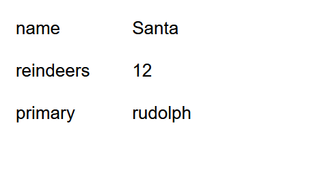
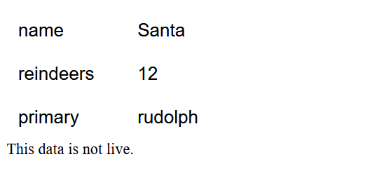
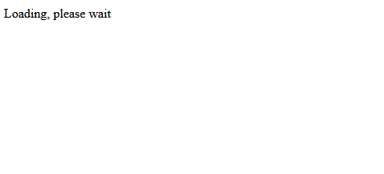

# Lab 05

### Due: Week 5, Sunday, 8:00 pm

### Value: 2 marks

## Overview

### Change Log

* 08-10: Clarified in Exercise 1, point 1, that statically adding html/css is not allowed

### Aim

* Become more familiar with AJAX, callbacks, promises.
* Become more familiar with the importance of accessibility in design.

## Exercise 1 - Fetch & JSON

A json file is stored at `http://www.cse.unsw.edu.au/~cs6080/20T3/data/package.json`.

1. Write a basic webpage in `store.html` that fetches the data this resource (URL), decodes the JSON, and then displays it in a well organised flex element/container on the webpage. You are not allowed to add static HTML or CSS to the webpage as part of this activity. You must generate everything on the page dynamically via javascript and DOM manipulation.

2. Before it displays it in the container, it should store a copy of the data in local storage
3. If there is an error accessing the URL, or there is an error decoding the information at that URL, the webpage will display the "cached" (stored in local storage) values and provide the user with a simple message informing them that "This data is not live."

4. Have the page say "Loading, please wait" (we don't care how it looks) while we're waiting for the asynchronous fetch/decode calls to complete (successfully or unsuccessfully). Once the page is ready to render, display it, and remove the "Loading, please wait" asset(s).

## Exercise 2 - accessibility.md

Choose one of the following two websites to analyse:
 * https://www.raywhite.com/
 * https://www.dymocks.com.au/

Write down your analysis of the chosen website in `accessibility.md`, where you should be taking note of a number of:
 * Description of the issues or non-compliance the site has to high accessibility standards
 * What steps you would take to rectify these issues

Aim for approximately 500 words.

Complete this analysis using a combination of:
 * Reviewing the page in a web browser visually (and at different sizes)
 * Source code review
 * Tools like Google Lighthouse (looking at accessibility)

## [Challenge] Exercise 3  - Convert promise to XML

In a new file `store_oldschool.html`, replace any usage of promise syntax (`Promise`, `.then()`, `.catch()`) with more basic callbacks and XML requests (AJAX). The week 4 lecture slides on callbacks/AJAX/promises will be helpful to understand this.

The aim of this exercise is to gain an understanding of some of the fundamental mechanisms that are still used on a lot of transpiled code.

## Submission Instructions

Your master branch will automatically submit itself at the due date listed at the top of this page. Once you have completed your work, you must ensure that your master branch (on gitlab) reflects the code that you want to have submitted.
