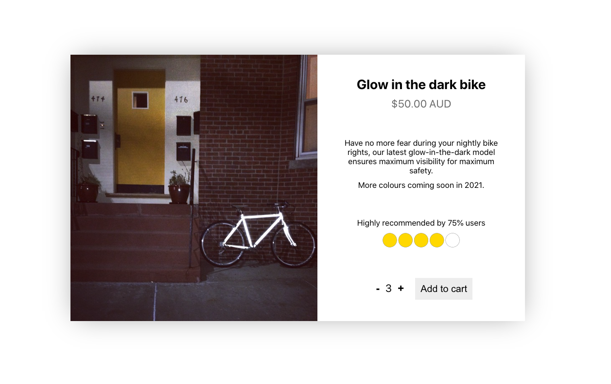

# Lab 09

### Due: Week 9, Sunday, 8:00 pm

### Value: 2 marks

## Overview

### Change Log

N/A

### Aim

* Develop further understanding of front-end testing
* Practice working with ReactJS components
* Develop further understanding of UI/UX.

## Part 1

This lab, you will be building a product card such as in `product.png`.



The component takes in the following props:
* `product` dictionary containing:
  * `id` string
  * `image` string of image file or url to image for the product preview
  * `title` string of product name
  * `price` number
  * `currency` string to be displayed next to the price
  * `descriptions` list of strings, containing the paragraphs of the product description
  * `recommendationRatio` number in range `[0, 1]` representing the portion of satisfied users
* `onAddToCart` event handler which is triggered when the `Add to cart` button is clicked, accepting parameters item `id` and `quantity`
* optional `discount` number in range `[0, 1]` representing the percentage discount to apply to the product e.g. if `price == 50` and `discount == 0.2`, then the displayed price will be `$40.00`

Your component must use the same structure as the reference, but you are free to style it to your liking.

Your component must adhere to the following requirements:
* There is an image preview of the product using the `image` input
* `image` has an appropriate `alt` description
* There is a title of the product using the `title` input
* `price` is displayed to two decimal places, with `discount` applied. The default value of `discount` is 0.
* `currency` is displayed next to `price`
* All strings in `descriptions` are displayed on the page
* There is text that reads `Highly recommended by [recommendationRatio]% users`, where `recommendationRatio` is displayed as a percentage value
* Clicking the `-`/`+` buttons will adjust the quantity displayed, which represents the number of items to add to the cart
* Clicking `Add to cart` will trigger on the `onAddToCart` handler with the item `id` and `quantity` as input parameters
* The buttons `-`/`+` have appropriate `aria-label` values (see [WCAG guidelines](https://www.w3.org/TR/WCAG20-TECHS/ARIA14.html) if you would like to better understand `aria-label`)

You may break this component down further into as many or as little components as you see fit, but you must test all the requirements in some capacity.

There are some images in `exercise/images/` that you may use for the product previews. Also see `exercise/src/App.js` for sample product input.

To view your component, run:

```yarn start```

## [Challenge] Part 2

Under `Highly recommended by [recommendationRatio]% users`, add a graphic to represent the user ratings. The graphic must be an SVG with five identical shapes, where the number of filled shapes is equal to `Math.ceil(recommendationRatio * 5)` i.e. if `recommendationRatio == 0.75` then there should be four filled shapes.

The reference image uses circles for the rating graphic, but you are free to construct your own shapes (i.e. triangles, square, heart, star). What's important is the number of filled shapes out of five. You do not need to write tests for this feature.

## Submission Instructions

Your master branch will automatically submit itself at the due date listed at the top of this page. Once you have completed your work, you must ensure that your master branch (on gitlab) reflects the code that you want to have submitted.